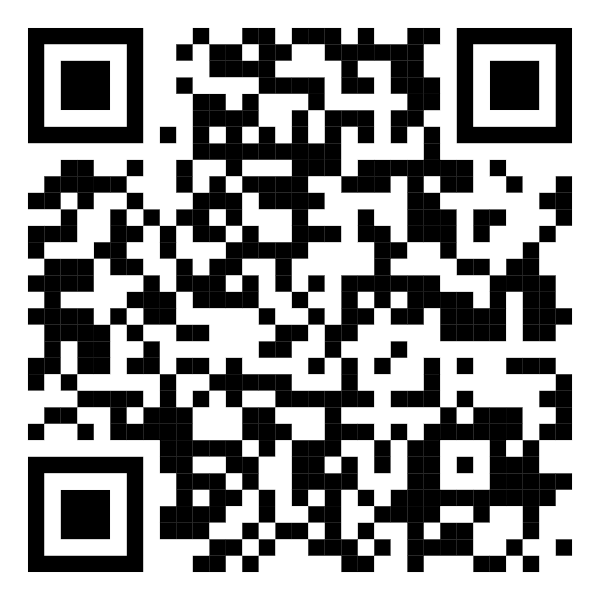

## The Hard- and Software of Blips and Boops

---

<!-- .slide: data-background-image="images/old-blip-boxes.jpg" -->
<!-- .slide: data-background-opacity="0.2" -->

## History

- Blip Box: 2017
- Boop Box: 2019
- Bloop Box: 2022

Note:
Used by:
- NordicFuzzCon
- Furvester
- CeSFuR
- SloFluffCon
- ScotiaCon
- Some french con
- Potentially more

---

<!-- .slide: data-background-image="images/bloop-boards.jpg" -->
<!-- .slide: data-background-opacity="0.2" -->

## Hardware

- Raspberry Pi Zero 2 W
- Three custom boards
- RC522 based NFC-Reader
- 3W Speaker

Note:
- multiple iterations to final product
- designed with KiCad and fully open source
- designed to be produced by JLCPCB (Not a sponsor!)

---

<!-- .slide: data-background-image="images/schematic-mainboard.jpg" -->
<!-- .slide: data-background-opacity="0.2" -->

Mainboard - connects everything

- Raspberry Pi Zero 2 W
- Tailboard for power, volume buttons and status LEDs
- RGB LED
- NFC-Reader
- Speaker via MAX98375 I2S Amplifier IC
- Optional UART and GPIO

Note:
I2S = Inter-Integrated Circuit Sound

---

<!-- .slide: data-background-image="images/schematic-tailboard.jpg" -->
<!-- .slide: data-background-opacity="0.2" -->

Tailboard

- USB-C port for power (5V only, no PD)
- Buttons
- Status LEDs

Note:
Different versions of tailboard developed, decided to keep it simple in the end
- first version had PD and voltage regulation
- power led
- 2 LEDs connected to GPIO for status
- 2 Buttons connected to GPIO for volume

---

<!-- .slide: data-background-image="images/schematic-led-board.jpg" -->
<!-- .slide: data-background-opacity="0.2" -->

LED-Board
- AW2013 I2C LED Controller
- Standard RGB LED

Note:
- can be set to any rgb color and can play simple effects

---

<!-- .slide: data-background-image="images/card-reader.jpg" -->
<!-- .slide: data-background-opacity="0.2" -->

NFC Scanner for Registration

Note:
- developed for registration/checkin
- cheaper than ready to use nfc readers
- no special drivers or software needed
- emulates a keyboard
- curently only reads the serial number but the hardware could do more

---

<!-- .slide: data-background-image="images/schematic-card-reader-1.jpg" -->
<!-- .slide: data-background-opacity="0.2" -->

NFC Scanner for Registration

- based on RP2040 Microcontroller
- same NFC Module as used in the Blips and Boops
- USB-C port for data connection
- Mode-Switch
- Status LEDs

---

<!-- .slide: data-background-image="images/schematic-card-reader-2.jpg" -->
<!-- .slide: data-background-opacity="0.2" -->

NFC Scanner CPU

Simplified version of a Raspberry Pi Pico
- simple LDO instead of Buck/Boost
- only needed GPIO broken out

---

<!-- .slide: data-background-image="images/ide-screenshot.jpg" -->
<!-- .slide: data-background-opacity="0.6" -->

## Software

---

## Protocol Spec

- Lightweight binary protocol
- Extensible
- Versioned
- Audio preload functionality

---

## Client

- Written in Rust
- Generalized client
- Custom audio files 
- Configured via NFC tags

Note:
Original Boop Box client was written in TypeScript

---

## Server

- Custom-written for each convention
- Can be implemented in any language

---

## NFC Scanner Firmware & SDK

- Scanner emulates keyboard
- Sends UID with key combo
- Browser SDK allows for easy integration

---

## Questions?

 <!-- .element: height="300" -->
 github.com/bloop-box

